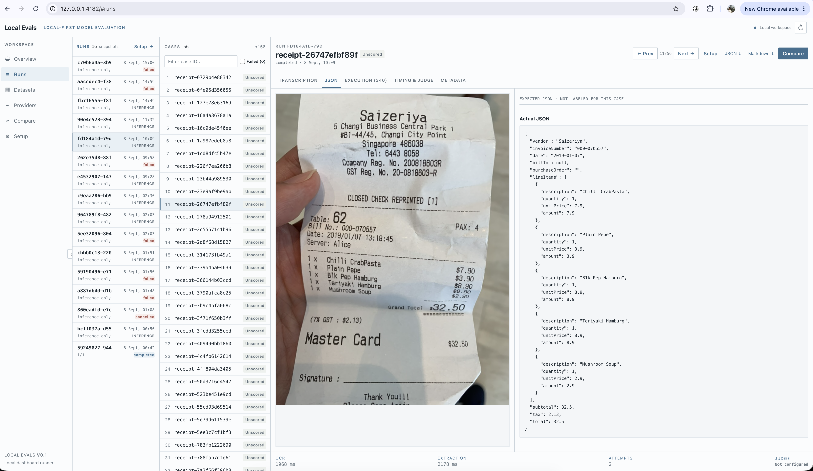

# Local Evals

A local-first app for evaluating document → JSON, text → JSON, and tool-call proposals with OpenAI-compatible providers or OpenRouter. Inspect inputs, outputs, scores, and execution logs side by side.



## Run the app

Requires **Node.js 22+**. From the repository directory:

```bash
npm install
npm run dev
```

Open [localhost:4173](http://127.0.0.1:4173). Configure a provider, import a dataset, then launch an evaluation from **Setup**. Data is stored locally in `.localevals/`.

For an offline demo with synthetic data and mock model responses, run `npm run demo` and open [localhost:4180](http://127.0.0.1:4180).

## CLI

Run CLI commands from the repository directory:

```bash
npm run localevals -- --help
npm run localevals -- run sample-data/manifest.jsonl sample-data/config.json --db .localevals/example.db
npm run localevals -- inspect --db .localevals/example.db
```

For the synthetic evaluation above, start `npm run mock` in another terminal first.

The CLI command is now `npm run localevals --` (formerly `npm run evalforge --`).

## Guides

- [Back up and move app data](docs/backups.md): portable backup, restore, and migration recovery.
- [Prepare datasets](docs/datasets.md) — images, text, tool-call expectations, and sample data.
- [Configure providers and models](docs/providers.md) — local endpoints, OpenRouter, and model capabilities.
- [Set up and run evaluations](docs/runs.md) — prompts, schemas, grading, and CLI usage.
- [Compare evaluation results](docs/comparison.md) — compare runs on the same dataset, inspect regressions, and export results.

## License

[Apache License 2.0](LICENSE).
